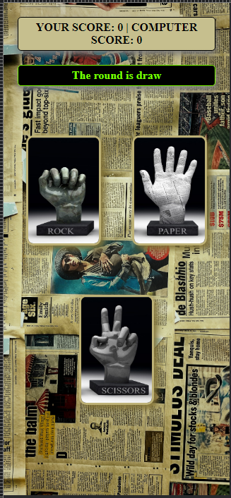

# rock-paper-scissors-2.0
 - This Project was create to practice the event JavaScript and be familiar on this concept, this rock, paper and scissors project is responsive to any device, and easy to play because of the layout of user interface that I created.

## Wireframe

# Demo: https://narvs1999.github.io/rock-paper-scissors-2.0/

## PC View

## Mobile View

## Technology I used:
#### HTML5

#### CSS3
  - flexbox layout
  - CSS Animation
  - etc
  
#### JavaScript
  - JavaScript Document Object Model
  - JavaScript Function
  - JavaScript Events
  - etc
  
## Objectives

  1. create a game(rock, paper and scissors)
  2. with computer enemy
  3. game with first of 5 score become winner
  4. (+) responsive User Interface
  5. (-) add some simple animation

## Features/Scope

  1. simple rock paper and scissors webpage base game.
  2. resposive layout
  3. first of 5 game.
  4. Versus Computer game.
